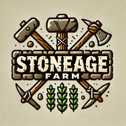

# 🪨 StoneAge - The Evolutionary Web3 Farming Universe



## 🌍 Overview

**StoneAge** is a multi-chain Web3 farming game built on **Ancient8** with cross-chain interoperability. Players start in the **Stone Age**, farming with primitive tools, harvesting crops, and trading in an evolving economy. Through technological advancements, they unlock futuristic tools, create alliances, and expand their farming empire. 

A **phenomenon called The Vortex** dynamically bridges economies across **Ethereum, BNB Chain, Ancient8, and more**, allowing users to trade cross-chain and engage in a **player-driven economic system**.

## 🚀 Key Features

### 🔄 Multi-Chain Economy & The Vortex
- AI-driven **economic balancing** opens temporary trade bridges between chains.
- Players from **Ancient8, Ethereum, BNB and more** can trade resources across blockchains.
- Dynamic **NFT marketplace** for farming tools, land, and rare artifacts.

### 🏞 Farming, Progression & Evolutionary Tools
- **Start in the Stone Age**, gradually evolving by purchasing better tools.
- **Own, expand, and trade land** as NFTs on the blockchain.
- **Upgrade tools** from primitive stone gear to futuristic high-tech farming equipment.
- **NFT crafting and swapping** allow players to combine resources for better tools.

### 🤝 Alliances & Guilds
- Players can **merge resources and form alliances** to unlock powerful upgrades.
- **Guild staking** for collective farming power and access to exclusive NFTs.

### 💰 In-Game Economy & Monetization
- **Trade crops, tools, and land** for cryptocurrency.
- **NFT marketplace** allows buying, selling, and upgrading equipment.
- **Yield farming & staking** mechanics for passive income.

### 🎟 Competitive Gameplay & Events
- Seasonal **leaderboards, tournaments, and special NFT drops**.
- **Time-travel events** introduce ultra-rare futuristic farming gear.
- **Guild-based farming battles** for land control and high-tier resources.

## 🛠 Tech Stack

- **Blockchain:** Ancient8, Ethereum, BNB Chain and more in the future (multi-chain interoperability via The Vortex)
- **Backend:** Node.js, Express, Socket.io
- **Frontend:** Unity (WebGL, Mobile, PC Support)
- **Smart Contracts:** Solidity
- **Storage:** IPFS
- **AI & Market Balancing:** Python-based dynamic pricing models

## 📂 Repository Structure
```
📦 StoneAge
├── 📂 backend          # Node.js API with WebSocket support
├── 📂 frontend         # Unity project files
├── 📂 contracts        # Smart contracts for NFTs, land, and marketplace
├── 📂 assets           # Game assets (models, textures, sound)
├── 📜 README.md        # Documentation
```

## 🎮 Getting Started

### Clone the Repository
```sh
git clone https://github.com/your-username/stoneage.git
cd stoneage
```

### Run Unity Frontend
- Open **Unity Hub**
- Import the **frontend** folder as a new project
- Click **Play** to start the game

## 🏆 Roadmap

### ✅ Phase 1: MVP Launch
- [x] Land ownership & farming mechanics
- [x] NFT-based tools & marketplace
- [x] Basic trade mechanics

### 🚀 Phase 2: Multi-Chain Interoperability
- [ ] Implement **The Vortex** for cross-chain trading
- [ ] Expand supported blockchains (**Ethereum, BNB, Ancient8**)

### 🔥 Phase 3: Competitive & Social Features
- [ ] Guilds & Alliances
- [ ] Seasonal leaderboards & events
- [ ] AI-driven dynamic economic balancing

## 🛡 Security & Audits
- **Smart contract audits** will be conducted before full release.
- **AI-driven market balancing** ensures stable in-game economics.
- **Interoperability protocols** verified for seamless cross-chain transactions.

## 🤝 Contributors
- **[@aj_success](https://x.com/aj_success)** - Blockchain Engineer
- **[@Abisuwa_Dunsin](https://x.com/Abisuwa_Dunsin)** - Game Designer

## 📢 Stay Connected
-
---


## 📜 License
This project is licensed under the **MIT License**.
